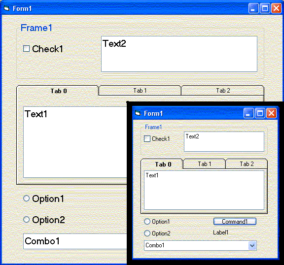



## Resize \- That Works with \(SSTAB\) and Font Resize \- Easy to understand

### Description

This code actually resizes your forms contents for you. Contents include SSTAB and does adjust the font size.
 
### More Info
 
Private Sub Form_Resize()

ResizeFormFor Me

End Sub

A nice thing about this code, It is very easy to understand.

Please note: I have received this code from a friend who has received this code from another friend, they both have extensively edited it and no one knows who the original program was of this. If that is you please let us know so we can give you credit for it. However I do know that everyone can use this code and it is free for your use…

The original code when I got it didn’t support SSTAB nor did it support FONT size changes. I added this feature.

As your window resizes your controls resize and re-position...

             |
---                |---
**Submitted On**   |2003-01-09 03:48:22
**By**             |[Bill Daugherty II](https://github.com/Planet-Source-Code/PSCIndex/blob/master/ByAuthor/bill-daugherty-ii.md)
**Level**          |Intermediate
**User Rating**    |4.7 (90 globes from 19 users)
**Compatibility**  |VB 6\.0
**Category**       |[Custom Controls/ Forms/  Menus](https://github.com/Planet-Source-Code/PSCIndex/blob/master/ByCategory/custom-controls-forms-menus__1-4.md)
**World**          |[Visual Basic](https://github.com/Planet-Source-Code/PSCIndex/blob/master/ByWorld/visual-basic.md)
**Archive File**   |[Resize\_\-\_T152630192003\.zip](https://github.com/Planet-Source-Code/bill-daugherty-ii-resize-that-works-with-sstab-and-font-resize-easy-to-understand__1-42291/archive/master.zip)

